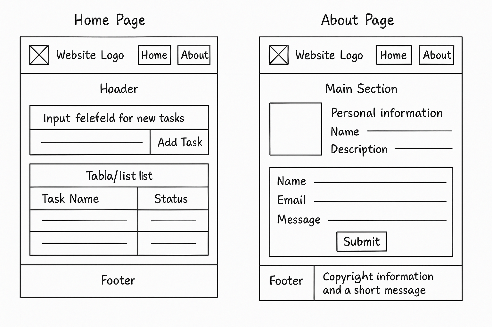

# My Tasks - Task Manager Website

## Wireframes

### Home And About Page

## Questions

**What observations or questions do you have about what you've learned so far?**
I've learned how to structure a basic project and link HTML, CSS, and JS files. I'm curious about how to make the task status dynamic (like changing from Pending to Completed).

**How long did it take you to complete this assignment? And how long did you expect it to take?**
It took me 3 hours. I expected it to take around 2 hours.